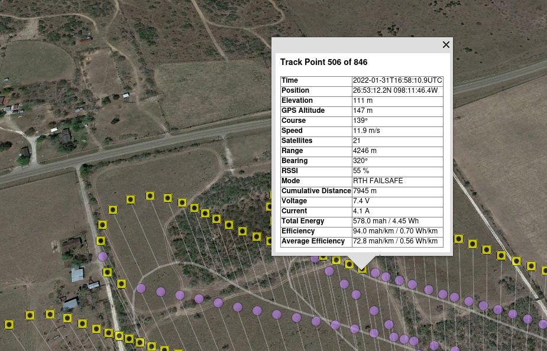

# flightlog2x

## Overview

A suite of tools to generate beautiful annotated, animated KML/KMZ files (and other data) from **inav** blackbox logs, OpenTX log files (inav S.Port telemetry, some support for OpenTX logs from Ardupilot), BulletGCSS and Aurduplot `.bin` logs.


#### INAV Fight Mode layer
<figure>
  
</figure>

#### RSSI layer
<figure>
  
</figure>

#### Efficiency layer
<figure>
  
</figure>

#### Point Annotation
<figure>
  
</figure>

### Statistics

```
$ bbsummary /t/inav-contrib/LOG00031.TXT
Log      : LOG00031.TXT / 1
Flight   :  on 2021-05-24 14:07:28
Firmware : INAV 2.6.1 (5510259e) OMNIBUSF4PRO of May  7 2021 14:19:33
Size     : 29.48 MB
Altitude : 113.0 m at 10:34
Speed    : 20.8 m/s at 07:24
Range    : 4461 m at 08:08
Current  : 7.4 A at 00:05
Distance : 12170 m
Duration : 14:05
Disarm   : Switch
```

## Documentation

[User Guide & Installation Instructions](https://stronnag.github.io/bbl2kml/)

## Graphical User Interface

There is a [graphical user interface for `flightlog2kml`](https://github.com/stronnag/fl2xui). Binaries are provided for Linux (`.deb`). There may also be a Windows installer.

## Other tools

The project includes the following:

* `flightlog2kml` : Generate KML/Z from log files
* `fl2mqtt` : Generate Bullet GCCS MQTT messages
* `fl2ltm` :  Generate (INAV) LTM (Lightweight Telemetry) messages
* `fl2sitl` : Replay BBL via the INAV SITL ([documentation](https://github.com/stronnag/bbl2kml/wiki/fl2sitl))
* `log2mission` : Generate an INAV mission file from a flight log
* `mission2kml` : General KML/Z from an INAV mission file
